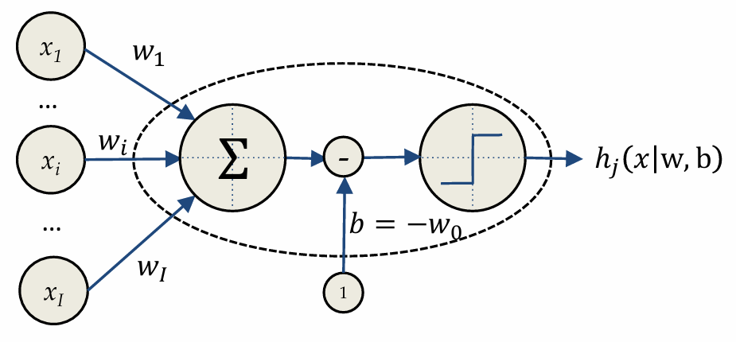
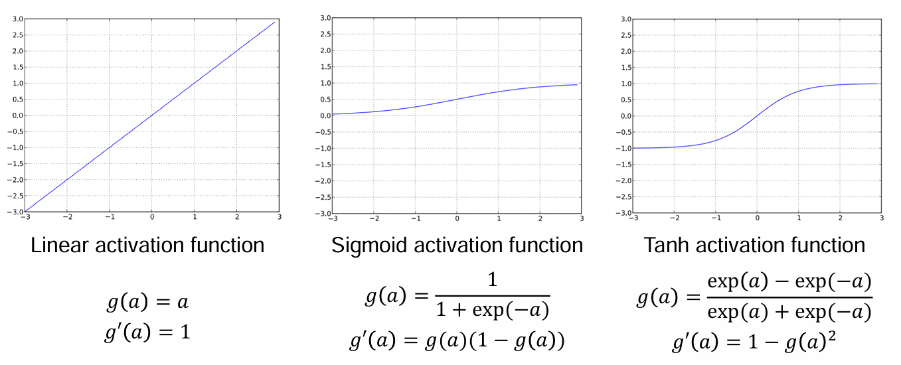
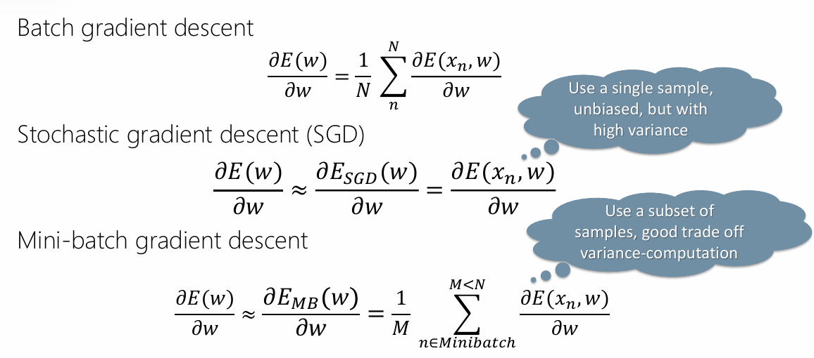
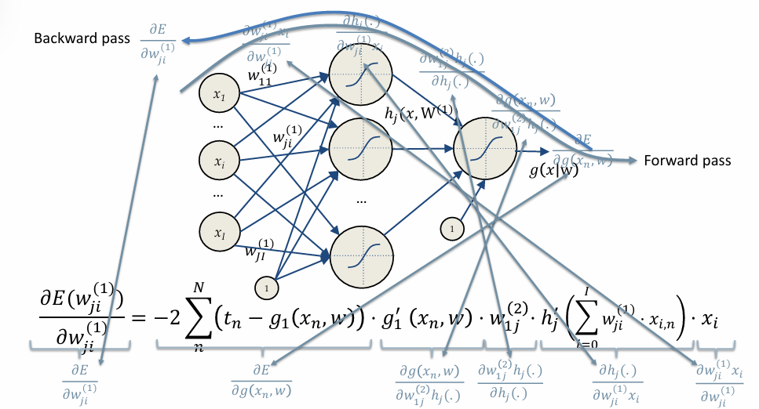
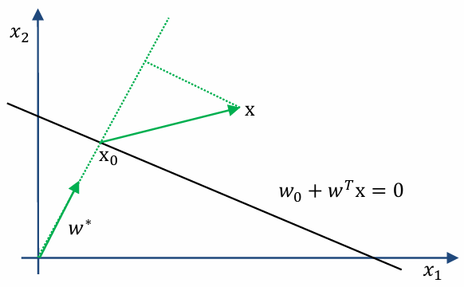
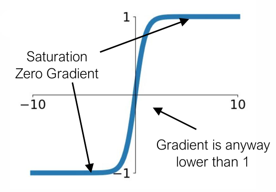

# Artificial Neural Networks and Deep Learning

## Introduction

Machine Learning is a category of research and algorithms focused on finding patterns in data and using those patterns to make predictions. ML falls within the AI umbrella, which in turn intersects with the broader field of knowledge discovery and data mining.

A computer program is said to learn from experience E (data) w.r.t. some class of task T (regression, classification, ..) and a performance measure P (error, loss, ..), if its performance at task in T, as measured by P, improves because of experience E.&#x20;

* Supervised learning: given the desired outputs $$t_1,..., t_N$$ learn to produce the correct output given a new set of input.
* Unsupervised learning: exploit regularities in the data D to build a representation to be used for reasoning or prediction.
* Reinforcement learning: producing actions $$a_1, ..., a_N$$ which affects the environment, and receiving rewards $$r_1, ..., r_N$$ learn to act in order to maximize rewards in the long term.&#x20;

Deep Learning is about learning data representation directly from raw data. DL is particularly effective in tasks like image recognition, speech recognition, and pattern recognition.\
During the last years, DL was enabled by the availability of large-scale datasets and the advances in hardware (ex. GPUs) to process vast amounts of data.

## From Perceptrons to Feed Forward Neural Networks

DL, while a crucial part of AI, is distinct from both traditional AI and ML. The field traces back to early efforts in the 1940s when computers were already capable of precise, rapid calculations but were limited by their inability to interact dynamically with environments or adapt to new data. This limitation led researchers to explore models inspired by the human brain, which operates in a massively parallel, fault-tolerant manner through billions of neurons and trillions of synapses.

### The perceptron

The development of Artificial Neural Networks began with the **perceptron**, introduced by Frank Rosenblatt in 1957. The perceptron was inspired by how biological neurons process information, receiving inputs, applying weights, and check if a certain threshold is crossed. Weights were encoded in potentiometers, and weight updates during learning were performed by electric motors.

The basic structure of a perceptron can be seen as:

$$
y = \begin{cases} 
1 \ \ \ \ \ \ \ \  if \ \sum^n_{i = 1}{ w_ix_i + b }> 0\\
-1 \ \ \ \ otherwise
\end{cases}
$$

where $$x_1, ..., x_n$$ are the input features, $$w_1, ..., w_n$$ are the weights assigned to each input features, $$b$$ is the bias term, and $$y$$ is the output of the perceptron. It calculates the dot product of the weights and inputs, adds the bias term and then applies the activation function (which in this case is a step function). If t.he result is greater than zero the output is 1, if it is less or equal zero the output is -1.

<figure><figcaption></figcaption></figure>

According to the **Hebbian learning** theory: _"the strength of a synapse increases according to the simultaneous activation of the relative input and the desired target"._ \
It states that if two neurons are active simultaneously, their connection is strengthened. The weight of the connection between A and B neurons is calculated using:

$$
\begin{cases}
w_i ^ {k+1} = w_i^k + \Delta w_i^k \\
\Delta w_i ^k = \eta \cdot x_i ^k \cdot t^k
\end{cases}
$$

where $$\eta$$ is the learning rate, $$x_i ^k$$ is the $$i^{th}$$ input of a neuron A at time k and $$t^k$$ is the desired output of neuron B at time k.\
Starting from a random initialization, the weights are fixed one sample at a time (online), only if the sample is not correctly predicted.

The perceptron is a **non-linear** function of a linear combination (input are combined linearly, but then the activation function is applied which is non-linear). The non-linearity is important since:&#x20;

* Non-linear models can approximate a wider range of functions (than linear models), including complex relationships in data.&#x20;
* Real-world phenomena are generally non-linear.
* Non-linear activation functions allow for stacking of layers in deep NN.

### Multi Layer Perceptrons (MLPs) - Feedforward Neural Networks (FFNN)

Deep feedforward networks (also called feedforward NN or MLPs) are the core of DL models.\
They are represented by a directed acyclic graph describing how the functions are composed together. The depth of the model is determined by the number of layers in the chain.

<figure><figcaption>
non-linear model characterized by the number of neurons, activation functions,  and the values of weights
</figcaption></figure>

* Activation functions must be differentiable to train it.&#x20;

<figure><figcaption></figcaption></figure>

* Layers are connected through weights $$W^{(l)} = \{w_{ji}^{(l)}\}$$.&#x20;
* The output of a neuron depends only on the previous layers $$h^{(l)} = \{h_j^{(l)}(h^{(l-1)}, W^{(l)})\}$$.

In regression the output spans the whole $$\mathbb{R}$$ domain: use a linear activation function for the output neuron.

In classification with two classes, chose according to their coding: $$\{\Omega_0 = -1, \Omega_1 = 1\}$$ then use tanh output activation, $$\{\Omega_0 = 0, \Omega_1 = 1\}$$ then use sigmoid output activation since it can be interpreted as class posterior probability.

When dealing with multiple classes (K) use as many neuron as classes: classes are coded with the one hot encoding $$\{\Omega_0 = [0\ 0\ 1], \Omega_1 = [0\ 1\ 0], \Omega_2 = [1\ 0\ 0\ ] \}$$ and output neurons use a softmax unit $$y_k = {exp(z_k) \over \sum_k exp(z_k)}$$ where $$z_k = \sum_j w_{kj}h_j(\sum_j ^I w_{ji}x_i)$$.

### Universal Approximator theorem

_“A single hidden layer feedforward neural network with S shaped activation functions can approximate any measurable function to any desired degree of accuracy on a compact set”._

_Regardless the function we are learning, a single layer can represent it. In the worst case, an exponential number of hidden units may be required. The layer may have to be unfeasibly large and may fail to learn and generalize._&#x20;

### Optimization, gradient descent (back propagation)

Assuming to have a parametric model $$y(x_n |  \theta )$$ (in regression/classification). \
Given a training set $$D = <x_1 , t_1> ... <x_N, t_N>$$ we want to find model parameters such that for new data $$y(x_n | \theta) \sim t_n$$ or in case of a NN $$g(x_n | w) \sim t_n$$. We rephrase the problem of learning into a problem of fitting.

For example, the given a linear model which minimizes $$E = \sum_n^N (t_n - g(x_n | w))^2$$ (taking into account that $$g(x_n | w)$$ is not linear since we are talking about NN).\
To find the minimum of a generic function, we compute the partial derivatives and set them to zero. Since closed-form solution are practically never available, we use iterative solutions (gradient descent): initialize the weights to a random value, iterate until convergence according to the update rule.

Finding the weights of a NN is not a linear optimization:

$$
argmin_w \ E(w) = \sum_{n=1}^N (t_n - g(x_n, w))^2
$$

We iterate starting from a initial random configuration:

$$
w^{k+1} = w^k - \eta {\partial E(w) \over \partial w}\bigg|_{w^k}
$$

To avoid local minima, we can use momentum:

$$
w^{k+1} = w^k - \eta {\partial E(w) \over \partial w}\bigg|_{w^k} - \alpha {\partial E(w) \over \partial w}\bigg|_{w^{k-1}}
$$

Since using all the data points (batch) might be unpractical, so we use variations of the GD:

<figure><figcaption></figcaption></figure>

In batch GD we use one batch and one epoch. \
In SDG we need as many steps (iterations) as the number of data points since we fix one data point at a time before we reach an epoch. \
In mini-batch GD we need as many steps (iterations) as the number of data divided by the batch size.

Weights update can be done in parallel, locally, and it requires only two passes. We apply the chain rule (derivative of composition of functions) to the back propagation formula obtaining:

<figure><figcaption></figcaption></figure>

### Maximum Likelihood Estimation

Let's observes samples $$x_1, ..., x_N$$ from a Gaussian distribution with known variance $$\sigma ^2$$. We want to find the Maximum Likelihood Estimator for $$\mu$$.\
Given the likelihood $$L(\mu) = p(x_1, .., x_N | \mu, \sigma^2) = \prod_{n=1} ^ N p(x_n | \mu, \sigma^2) = \prod^N_{n=1} {1 \over \sqrt{2 \pi} \sigma} e^{- {(x - \mu)^2 \over 2 \sigma^2}}$$, we take the logarithm obtaining $$l(\mu) = N \cdot log{1 \over \sqrt{2 \pi} \sigma} - {1 \over 2 \sigma ^2} \sum ^N_n (x_n - \mu)^2$$, we work out the derivative in order to find the minimum:

$$
\mu^{MLE} = {1 \over N} \sum_n^N x_n
$$

Let's apply this to NN.&#x20;

For regression the goal is to approximate a target function $$t = g(x_n | w) + \epsilon_n$$with $$\epsilon_n \sim N(0, \sigma^2)$$ having N observation: $$t_n \sim N(g(x_n |w), \sigma ^2)$$.\
We write the MLE for the data and look for the weights which maximize the log-likelihood:

$$
argmin_w \sum_n^N (t_n - g(x_n | w))^2
$$

We have to minimize the sum of squared errors.

For classification the goal is to approximate a posterior probability $$t$$ having $$N$$ observation: $$g(x_n|w) = p(t_n|x_n)$$ with $$t_n \in \{0, 1\}$$ so that $$t_n \sim Be(g(x_n|w))$$. \
We write the MLE for the data and look for the weights which maximize the log-likelihood:

$$
argmin_w - \sum_n^N t_n log\  g(x_n|w) + (1- t_n)log(1-g(x_n|w))
$$

We have to minimize the binary cross entropy.

Error functions (like the ones just defined) define the task to be solved. They are defined using knowledge/assumptions on the data distribution, exploiting background knowledge on the task and the model or by trial and error.

### Perceptron Learning Algorithm

Let's consider the hyperplane (affine set) $$L \in \mathbb{R}^2$$ $$L: w_0 + w^Tx = 0$$.\
Any two points $$x_1 , x_2$$ on $$L \in \mathbb{R}^2$$ have $$w^T (x_1 - x_2) = 0$$. \
The versor normal to $$L \in \mathbb{R}^2$$ is then $$w^* = {w \over ||w||}$$.\
For any point $$x_0$$ in $$L \in \mathbb{R}^2$$ we have $$w^Tx_0 = -w_0$$.\
The signed distance of any point $$x$$ from $$L \in \mathbb{R}^2$$ is defined by $$w^{*T}(x - x_0) = {1 \over ||w||}(w^Tx + w_0)$$. The idea is that $$(w^Tx + x_0)$$ is proportional to the distance of $$x$$ from the plane defined by $$(w^Tx + w_0) = 0$$.

<figure><figcaption></figcaption></figure>

It can be shown that the error function the Hebbian rule is minimizing is the distance of misclassified points from the decision boundary. \
Let's code the perceptron output as +1/-1:

* If an output which would be +1 is misclassified then $$w^Tx + w_0 <0$$.
* For an output with -1 we have the opposite.

The goal becomes minimizing:&#x20;

$$
D(w, w_0) = - \sum_{i \in M} t_i(w^Tx_i + w_0)
$$

This is non negative and proportional to the distance of the missclassified points form $$w^Tx + w_0 = 0$$.\
By minimizing it with the stochastic gradient descend we obtain:

## Neural Network Training and Overfitting

### Universal approximator

"A single hidden layer feedforward neural network with S shaped activation functions can approximate any measurable function to any desired degree of accuracy on a compact set"

Regardless of what function we are learning, a single layer can do it: it does not mean that we can find the necessary weights, an exponential number of hidden units may be required and it might be useless in practice if it does not generalize.

### Model complexity

Too simple models underfit the data, while too complex model overfit the data and do not generalize.

A way to measure generalization is not trough training error/loss: the classifier has been learning from that data, so any estimate on that data will be optimistic. New data will probably not be exactly the same as training data.\
We need to test on an independent test set that can come from a new dataset, by splitting the initial data or by performing random sub sampling (with replacement) of the dataset.&#x20;

<figure><figcaption></figcaption></figure>

* Training dataset: the available data.
* Training set: the data used to learn model parameters.
* Test set: the data used to perform the final model assessment.&#x20;
* Validation set: the data used to perform model selection.
* Training data: used to train the model (fitting + selection).
* Validation data: used to assess the model quality (selection + assessment).

#### Cross-validation

Cross-validation is the use of the training dataset to both train the model (parameter fitting + model selection) and estimate its error on new data.&#x20;

* When lots of data are available use a Hold Out set and perform validation: hold out error might be biased by the specific split.&#x20;
* When we have few data available use Leave-One-Out Cross-Validation (LOOCV): it is unbiased but unfeasible with lots of data.
* K-fold Cross-Validation is a good trade-off (sometime better than LOOCV).

Be aware of the number of model you get and how much it cost it to train.&#x20;

## Preventing Neural Network Overfitting

### Early stopping: limiting overfitting by cross-validation

Overfitting networks show a monotone training error trend (on average with SDG) as the number of gradient descent iterations k, but they lose generalization at some point.&#x20;

* Hold out some data.
* Train on the training set.
* Perform cross-validation on the hold out set.
* Stop train when validation error increases: it is an online estimate of the generalization error.

<figure><figcaption></figcaption></figure>

Model selection and evaluation happens at different levels: at parameters level, when we learn the weights for a NN, at hyperparameters level, when we choose the number of layers or hidden neurons for a given layer. At some point, adding layers or hidden neurons only adds overfitting.&#x20;

### Weight decay: limiting overfitting by weights regularization

Regularization is about constraining the model "freedom", based on a-priori assumption on the model, to reduce overfitting. \
So far we have maximized the data likelihood: $$w_{MLE} = argmax_w P (D|w)$$.\
We can reduce model "freedom" by using a Bayesian approach: $$w_{MAP} = argmax_w P(w|D) = argmax_wP(D|w) \cdot P(w)$$ (we make assumption on parameters a priori distribution).\
In general, small weights improve generalization of NN: $$P(w) \sim N(0, \sigma^2_w)$$ it means assuming that on average the weights are close to zero.&#x20;

<figure><figcaption></figcaption></figure>

We can use cross-validation to select the proper $$\gamma$$:&#x20;

* Split data in training and validation sets.
* Minimize for different values of $$\gamma$$:  $$E_{\gamma}^{TRAIN} = \sum_{n=1}^{N_{TRAIN}} (t_n - g(x_n | w))^2 + \gamma \sum_{q=1}^Q (w_q)^2$$.
* Evaluate the model:  $$E_{\gamma^*}^{ VAL} = \sum_{n=1}^{N_{VAL}} (t_n - g(x_n | w))^2$$.
* Chose the $$\gamma ^ ∗$$ with the best validation error.
* Put back alla data together and minimize:  $$E_{\gamma^∗} = \sum_{n=1}^{N} (t_n - g(x_n | w))^2 + \gamma \sum_{q=1}^Q (w_q)^2$$.

### Dropout: limiting overfitting by stochastic regularization

By turning off randomly some neurons we force to learn an independent feature preventing hidden units to rely on other units (co-adaptation). We train a subset of the full network at each epoch. On average we are using 70% of the network. \
It behaves as an ensemble method.

Dropuout trains weaker classifiers, on different mini-batches and then at test time we implicitly average the responses of all ensemble members. At testing time we remove masks and average output by weight scaling.&#x20;

## Trips and tricks: best practices

### Better activation functions

Activation functions such as Sigmoid or Tanh saturate: the gradient is close to zero, or anyway less than 1. This is an issue in back-propagation, since it requires gradient multiplication and in this way learning in deep networks does not happen. It is the varnishing gradient problem.&#x20;

<figure><figcaption></figcaption></figure>

To overcome this problem we can use the Rectified Linear Unit (ReLU) activation function: $$g(a) = ReLu(a) = max(0,a)$$, $$g'(a) = 1_{a >0}$$. \
It has several advantages:

* Faster SDG convergence.
* Sparse activation (only part of hidden units are activated),
* Efficient gradient propagation (no vanishing or exploding gradient problems) and efficient computation (just threesholding at zero).
* Scale invariant: $$max(0, a) = a \ max(0,x)$$.

It has potential disadvantages:

* Non differentiable at zero: however it is differentiable everywhere else.
* Non-zero centered output.
* Unbounded: it could potentially blow up.
* Dying neurons: ReLU neurons can sometimes be pushed into states in which they become inactive for essentially all inputs. No gradients flow backward trough the neuron, and so the neuron becomes stuck and dies. Decreased model capacity happens with high learning rates.&#x20;

Some variants of the ReLU are:

* Leaky ReLU: fix for the "dying ReLU" problem.&#x20;

$$
x \ \ \ \ if \ x\ge 0 \\ 0,01x \ \ \ otherwise
$$

* ELU: try to make the mean activations closed to zero which speeds up learning. Alpha is tuned by hand.

$$
x \ \ \ \ if \ x\ge 0 \\ \alpha (e^x -1) \ \ \ otherwise
$$

<figure><figcaption></figcaption></figure>

### Weights initialization

The final result of the gradient descent if affected by weight initilization. We have to avoid zero (all gradient would be zero, no learning will happen), big numbers (if unlucky it might take very long to converge).&#x20;

We can take $$w \sim N(0, \sigma^2 = 0,01)$$ that is good for small networks, but it might be a problem for deeper NN.

In deep networks if weights starts too small, then gradient shrinks ad it passes trough each layer, if they start too large, then gradient grows as it passes trough each layer until it is too massive to be useful. Weights should not bee to small nor too large.&#x20;

#### Xavier initialization

Suppose we have an input $$x$$ with $$I$$ components and a linear neuron with random weights $$w$$. Its output is $$h_j = w_{j1}x_1 + ... + w_{ji}x_I + ...  + w_{jI}x_I$$.\
We can derive that $$f(x) = x * e^{2 pi i \xi x}$$$$Var(w_{ji}x_i) = E[x_i ]^2 Var(w_{ji}) + E[w_{ji}]^2Var(x_i)+Var(w_{ji})Var(x_i)$$.\
Now if our inputs and weights both have mean zero, that simplifies to $$Var(w_{ji}x_i) = Var(w_{ji})Var(x_i)$$.\
If we assume that all $$w_i$$ and $$x_i$$ are i.i.d. we obtain $$Var(h_j) = Var(w_{j1}x_1 + ... + w_{ji}x_I + ...  + w_{jI}x_I) = I * Var(w_i)Var(x_i)$$: the variance of the input is the variance of the output scaled by $$I * Var(w_i)$$.\
If we want the variance of the input and the output to be the same we need to impose $$I * Var(w_j) = 1$$.&#x20;

For this reason Xavier proposes to initialize $$w \sim N(0, 1/n_{in})$$.

By performing similar reasoning for the gradient Glorot & Bengio found $$n_{out} Var(w_j) = 1$$ and to accomodate that Xavier proposes $$w \sim N(0, {2 \over n_{in} + n_{out}}))$$.

More recently He proposed $$w \sim N(0, 2 / n_{in})$$,

### More about gradient descent: Nesterov Accelerated gradient

#### &#x20;Idea: make a jump as momentum, then adjust.&#x20;

<figure><figcaption></figcaption></figure>

### Adaptive Learning Rates

Neurons in each layer learn differently: gradient magnitudes very across layers, early layer get "vanishing gradients". Ideally, we should use separate adaptive learning rates.

### Batch normalization

Networks converge faster if inputs have been whitened (zero mean, unit variances) and are uncorrelated to account for covariate shift. \
We can have internal covariate shift: normalization could be useful also at the level of hidden layers. \
Batch normalization is a technique to cope with this:

* Forces activations to take values on a unit Gaussian at the beginning of the training.&#x20;
* Adds a BatchNorm layer after fully connected layers (or convolutional layers) and before nonlinearities.
* It can be interpreted as doing preprocessing at every layer of the network, but integrated into the network itself in a differentiable way.

In practice:

* Each unit’s pre-activation is normalized (mean subtraction, stddev division).
* During training, mean and stddev are computed for each minibatch.
* Back-propagation takes into account normalization.
* At test time, the global mean/stddev are used (global statistics are estimated using training running averages).

They are linear operations, so it can be back-propagated.&#x20;

* It improves the gradient flow through the network.
* It allow using higher learning rates (faster learning).
* It reduce the strong dependence on weights initialization.
* It act as a form of regularization slightly reducing the need for dropout.
